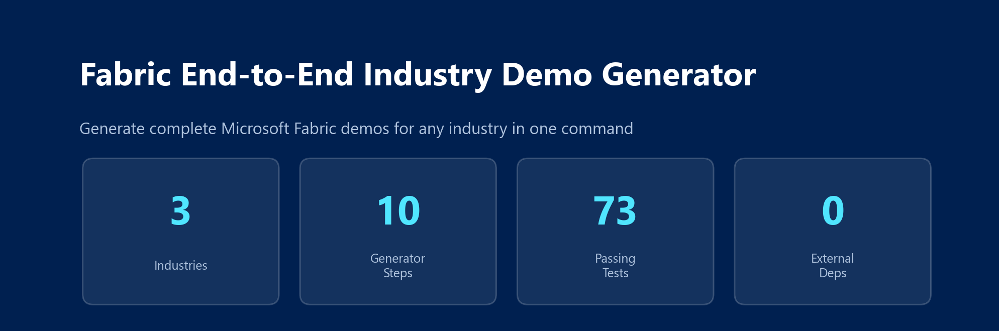
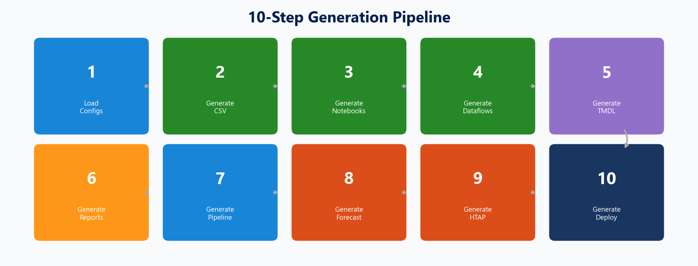
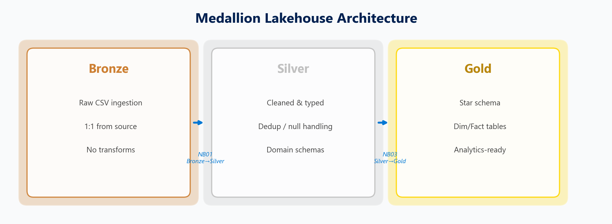
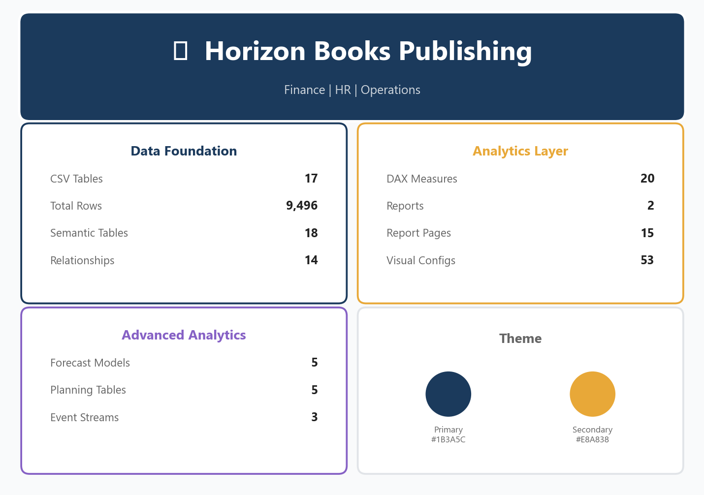
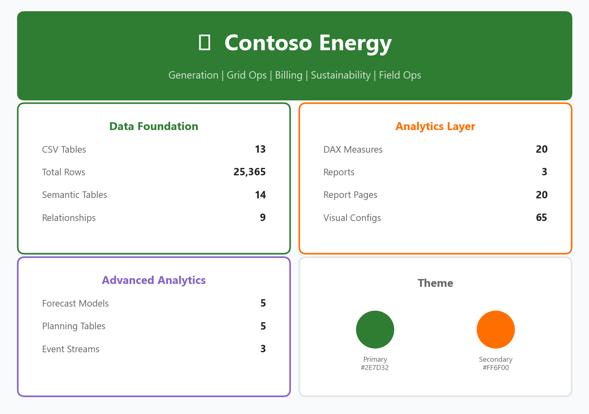
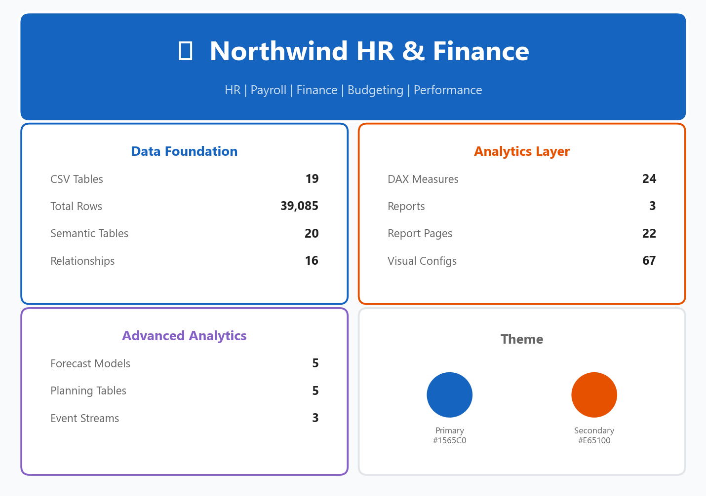
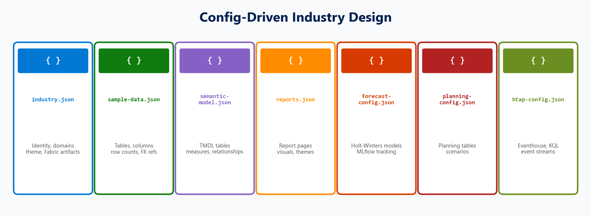
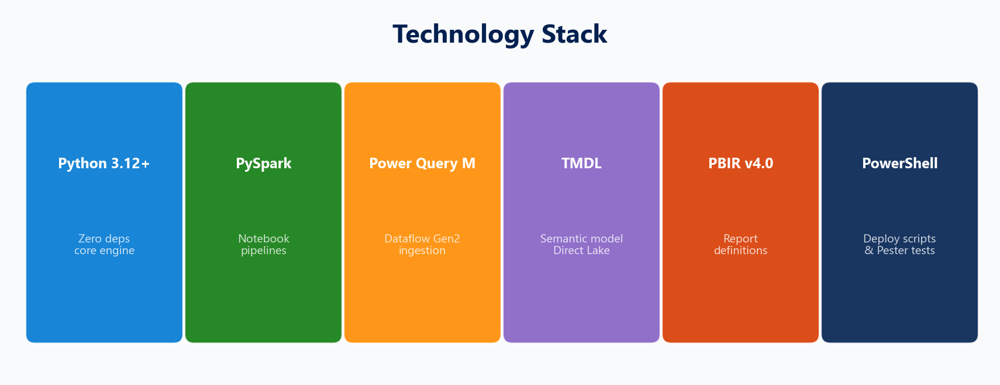
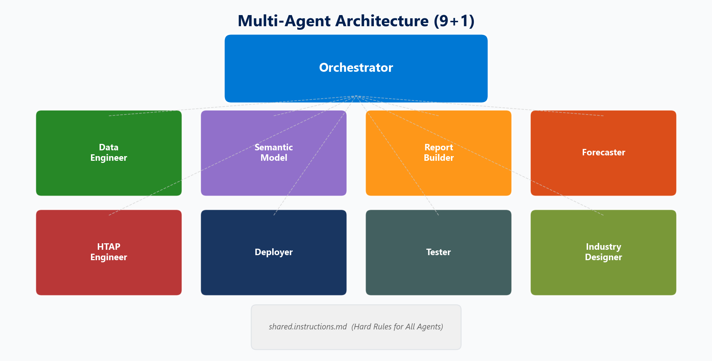
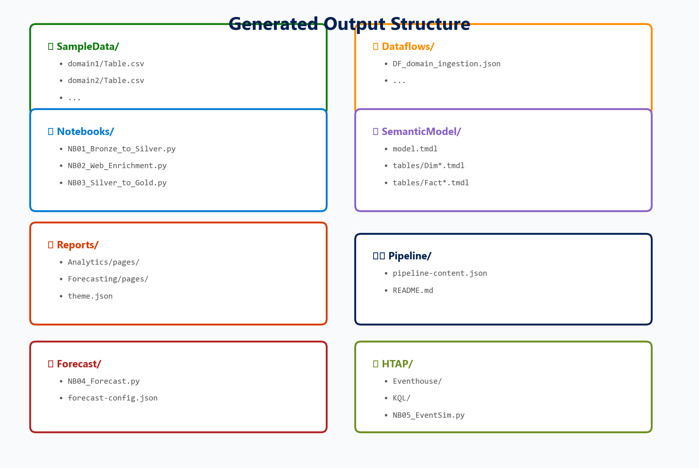

<p align="center">
  
</p>

<p align="center">
  <strong>Generate complete Microsoft Fabric end-to-end demos for any industry — in one command.</strong><br>
  Medallion Lakehouse &bull; PySpark Notebooks &bull; Dataflow Gen2 &bull; TMDL Semantic Model &bull; PBIR Reports &bull; Forecasting &bull; HTAP
</p>

<p align="center">
  
  
  
  
  
</p>

---

## Quick Start

```powershell
# List available industries
python generate.py --list

# Generate a complete Fabric demo
python generate.py -i horizon-books

# Custom output directory + reproducible seed
python generate.py -i contoso-energy -o ./my-output --seed 42
```

Or use the PowerShell wrapper:

```powershell
.\generate.ps1 -Industry horizon-books
.\generate.ps1 -List
```

**That's it.** One command produces CSV data, PySpark notebooks, Dataflow Gen2 configs, a full TMDL semantic model, Power BI reports, a data pipeline, forecasting notebooks, real-time analytics (HTAP), and PowerShell deployment scripts.

---

## 10-Step Generation Pipeline

<p align="center">
  
</p>

| Step | Generator | Output |
|:---:|---|---|
| **1** | Config Loader | Validates industry JSON configs against schemas |
| **2** | CSV Generator | Synthetic data with FK integrity per domain |
| **3** | Notebook Generator | PySpark NB01–NB06 (Bronze→Silver→Gold + diagnostics) |
| **4** | Dataflow Generator | Power Query M ingestion configs |
| **5** | TMDL Generator | Direct Lake semantic model (tables, measures, relationships) |
| **6** | Report Generator | PBIR v4.0 pages, visuals, themes |
| **7** | Pipeline Generator | Fabric Data Pipeline JSON orchestration |
| **8** | Forecast Generator | Holt-Winters + MLflow tracking notebooks |
| **9** | HTAP Generator | Eventhouse, KQL database, event simulator |
| **10** | Deploy Generator | PowerShell scripts (Deploy, Upload, Validate) |

---

## Medallion Lakehouse Architecture

<p align="center">
  
</p>

Every generated demo follows the **Bronze → Silver → Gold** pattern:

| Layer | Notebook | Purpose |
|---|---|---|
| **Bronze** | NB01 | Raw CSV ingestion into Lakehouse tables, no transforms |
| **Silver** | NB01 | Cleaning, typing, dedup, null handling, domain schemas |
| **Gold** | NB03 | Star schema (Dim/Fact), DimDate generation, analytics-ready |

Additional notebooks:
- **NB02** — Web enrichment (external API data)
- **NB04** — Holt-Winters forecasting with MLflow
- **NB05** — HTAP event simulator (real-time stream generation)
- **NB06** — Diagnostic (table inventory, null audit, row counts)

---

## Available Industries

### Horizon Books Publishing

<p align="center">
  
</p>

> Mid-size book publisher operating 6 imprints from New York HQ with international operations in London, Tokyo, Frankfurt, and Mexico City.

**Domains:** Finance · HR · Operations
**Scenario:** Revenue analytics, royalty tracking, warehouse operations, workforce management

| Metric | Count |
|---|---|
| CSV Tables | 17 |
| Total Sample Rows | 9,496 |
| Semantic Model Tables | 18 |
| DAX Measures | 20 |
| Report Pages | 15 |
| Forecast Models | 5 (Holt-Winters) |
| Event Streams | 3 (Orders, Inventory, Returns) |

---

### Contoso Energy

<p align="center">
  
</p>

> Full-spectrum energy utility covering power generation, grid operations, customer billing, sustainability compliance, and field operations.

**Domains:** Generation · Grid Operations · Customer Billing · Sustainability · Field Ops
**Scenario:** Renewable energy mix, grid load monitoring, outage analysis, emissions tracking, safety compliance

| Metric | Count |
|---|---|
| CSV Tables | 13 |
| Total Sample Rows | 25,365 |
| Semantic Model Tables | 14 |
| DAX Measures | 20 |
| Report Pages | 20 |
| Forecast Models | 5 (Generation, Demand, Revenue, Emissions, Maintenance) |
| Event Streams | 3 (Grid Telemetry, SCADA, Billing) |

---

### Northwind HR & Finance

<p align="center">
  
</p>

> Human resources, payroll, financial accounting, budgeting, and corporate performance management for Northwind Traders.

**Domains:** HR · Payroll · Financial Accounting · Budgeting · Corporate Performance
**Scenario:** Workforce analytics, compensation benchmarking, GL reconciliation, budget variance, KPI scorecards

| Metric | Count |
|---|---|
| CSV Tables | 19 |
| Total Sample Rows | 39,085 |
| Semantic Model Tables | 20 |
| DAX Measures | 24 |
| Report Pages | 22 |
| Forecast Models | 5 (Payroll, Attrition, Collections, Budget, Headcount) |
| Event Streams | 3 (Payroll, Journal, HR Audit) |

---

## Config-Driven Design

<p align="center">
  
</p>

Each industry is defined by **7 JSON config files** — no code changes needed to add a new industry:

| Config | Purpose |
|---|---|
| `industry.json` | Identity, domains, theme colors, Fabric artifact names |
| `sample-data.json` | Table definitions, column types, row counts, FK references |
| `semantic-model.json` | TMDL tables, DAX measures, relationships |
| `reports.json` | Report pages, visual types, field mappings |
| `forecast-config.json` | Holt-Winters models, horizon, MLflow settings |
| `planning-config.json` | Planning IQ tables, scenarios, growth rates |
| `htap-config.json` | Eventhouse, KQL database, event stream definitions |

### Adding a New Industry

```bash
# 1. Create config folder
mkdir industries/my-industry

# 2. Copy and customize configs
cp industries/horizon-books/*.json industries/my-industry/

# 3. Generate
python generate.py -i my-industry
```

All configs are validated against JSON schemas at load time (see `core/schemas/`).

---

## Technology Stack

<p align="center">
  
</p>

| Technology | Role |
|---|---|
| **Python 3.12+** | Core engine — zero external dependencies |
| **PySpark** | Generated notebook code (Bronze→Silver→Gold) |
| **Power Query M** | Dataflow Gen2 ingestion configs |
| **TMDL** | Semantic model definitions (Direct Lake) |
| **PBIR v4.0** | Power BI report definitions |
| **PowerShell 5.1+** | Deployment scripts + Pester 5 tests |

### Optional Dependencies

```
pip install matplotlib pillow   # For docs/generate_diagrams.py
```

---

## Multi-Agent Architecture

<p align="center">
  
</p>

The project uses **9+1 specialized agents** defined in `.github/agents/`:

| Agent | Responsibility | Key Files |
|---|---|---|
| **Orchestrator** | CLI entry, config loading, pipeline coordination | `generate.py` |
| **Data Engineer** | CSV, Notebook, Dataflow generation | `csv_generator.py`, `notebook_generator.py`, `dataflow_generator.py` |
| **Semantic Model** | TMDL tables, measures, relationships | `tmdl_generator.py` |
| **Report Builder** | PBIR pages, visuals, themes | `report_generator.py` |
| **Forecaster** | Holt-Winters + MLflow notebooks | `forecast_generator.py` |
| **HTAP Engineer** | Eventhouse + KQL + event simulator | `htap_generator.py` |
| **Deployer** | PowerShell deployment scripts | `deploy_generator.py` |
| **Tester** | Test suite, coverage, Pester validation | `pester_generator.py` |
| **Industry Designer** | New industry config authoring | `industries/` |
| **Shared** | Hard constraints for all agents | `shared.instructions.md` |

---

## Generated Output Structure

<p align="center">
  
</p>

```
output/<industry>/
├── SampleData/
│   ├── finance/          # Domain-organized CSV files
│   ├── hr/
│   └── operations/
├── Notebooks/
│   ├── NB01_Bronze_to_Silver.py
│   ├── NB02_Web_Enrichment.py
│   ├── NB03_Silver_to_Gold.py
│   └── NB06_Diagnostic.py
├── Dataflows/
│   └── DF_<domain>_ingestion.json
├── SemanticModel/
│   ├── model.tmdl
│   ├── tables/           # One .tmdl per table
│   ├── relationships/    # One .tmdl per relationship
│   └── definition.pbism
├── Reports/
│   ├── <Report>-Analytics/
│   │   ├── report.json
│   │   ├── pages/        # One folder per page
│   │   └── theme.json
│   └── <Report>-Forecasting/
├── Pipeline/
│   ├── pipeline-content.json
│   └── README.md
├── Forecast/
│   ├── NB04_Forecast.py
│   └── forecast-config.json
├── HTAP/
│   ├── eventhouse-definition.json
│   ├── kql-database-script.kql
│   ├── NB05_EventSimulator.py
│   ├── bridge-queries.kql
│   └── README.md
└── Deploy/
    ├── Deploy-Full.ps1
    ├── <Company>.psm1
    ├── Upload-SampleData.ps1
    └── Validate-Deployment.ps1
```

---

## Project Structure

```
FabricEndtoEnd/
├── generate.py                  # CLI entry point (10-step pipeline)
├── generate.ps1                 # PowerShell wrapper
├── core/                        # Core generator engine
│   ├── config_loader.py         # JSON config loading & validation
│   ├── template_engine.py       # {{PLACEHOLDER}} template rendering
│   ├── csv_generator.py         # Synthetic data generation (FK integrity)
│   ├── notebook_generator.py    # PySpark notebook generation (NB01–NB06)
│   ├── dataflow_generator.py    # Dataflow Gen2 Power Query M generation
│   ├── tmdl_generator.py        # TMDL semantic model generation
│   ├── report_generator.py      # PBIR v4.0 report generation
│   ├── pipeline_generator.py    # Fabric Data Pipeline JSON generation
│   ├── forecast_generator.py    # Holt-Winters + MLflow notebook generation
│   ├── planning_generator.py    # Planning IQ tables & notebooks
│   ├── htap_generator.py        # Eventhouse, KQL, event simulator
│   ├── deploy_generator.py      # PowerShell deployment scripts
│   ├── pester_generator.py      # Pester 5 test suite generation
│   └── schemas/                 # JSON validation schemas
├── industries/                  # Per-industry config files
│   ├── horizon-books/           # 7 JSON configs
│   ├── contoso-energy/          # 7 JSON configs
│   └── northwind-hrfinance/     # 7 JSON configs
├── templates/                   # .tpl template files
├── tests/                       # pytest test suite (73 tests)
│   └── core/                    # Unit tests per module
├── docs/                        # Documentation
│   ├── images/                  # Generated PNG diagrams
│   └── generate_diagrams.py     # Diagram generation script
└── .github/agents/              # 9+1 agent definitions
```

---

## Running Tests

```bash
# Run all tests
python -m pytest tests/core/ -v

# Run with coverage
python -m pytest tests/core/ -v --cov=core --cov-report=term-missing
```

**Current status:** 73 tests passing across 5 test modules.

| Module | Tests | Coverage Area |
|---|---|---|
| `test_config_loader.py` | 18 | Config loading, validation, schemas |
| `test_csv_generator.py` | 11 | CSV generation, FK integrity, reproducibility |
| `test_report_generator.py` | 14 | PBIR reports, pages, visuals, themes |
| `test_template_engine.py` | 14 | Placeholder rendering, `{{#if}}`, `{{#each}}` |
| `test_tmdl_generator.py` | 16 | TMDL tables, measures, relationships |

---

## Generation Results

All 3 industries generate successfully with the full 10-step pipeline:

| | Horizon Books | Contoso Energy | Northwind HR/Finance |
|---|:---:|:---:|:---:|
| **CSV Files** | 17 | 13 | 19 |
| **Notebooks** | 4 | 4 | 4 |
| **Dataflows** | 4 | 6 | 6 |
| **TMDL Tables** | 18 | 14 | 20 |
| **Relationships** | 14 | 9 | 16 |
| **Report Files** | 74 | 94 | 107 |
| **Pipeline** | 2 | 2 | 2 |
| **Forecast** | 2 | 2 | 2 |
| **HTAP** | 6 | 6 | 6 |
| **Deploy Scripts** | 4 | 4 | 4 |

---

## Advanced Features

### Forecasting (Holt-Winters + MLflow)

Each industry includes forecasting models with:
- **Additive seasonal decomposition** (configurable alpha, beta, gamma)
- **MLflow experiment tracking** (RMSE, MAE, MAPE metrics)
- **Fallback chain**: Holt-Winters → Naive seasonal
- Configurable forecast horizons (6–12 months)

### Planning in Fabric IQ

Planning notebooks generate:
- SQL schema setup for planning tables
- Multi-scenario population (Base, Optimistic/Growth, Conservative/Austerity)
- Plan vs. Actual comparison tables

### HTAP — Real-Time Analytics

Complete Eventhouse setup with:
- **KQL database** definitions with retention policies
- **Event simulator** notebook (NB05) generating synthetic streaming data
- **Hot-cold bridge** queries joining real-time Eventhouse data with Lakehouse facts
- KQL aggregation queries per event stream

### Deployment Scripts

Generated PowerShell scripts include:
- `Deploy-Full.ps1` — End-to-end Fabric workspace provisioning
- `<Company>.psm1` — Shared module (token management, API helpers)
- `Upload-SampleData.ps1` — OneLake data upload
- `Validate-Deployment.ps1` — Post-deployment validation

---

## Requirements

| Requirement | Version | Notes |
|---|---|---|
| **Python** | 3.12+ | No external dependencies for core generation |
| **PowerShell** | 5.1+ | Optional, for `generate.ps1` and deploy scripts |
| **matplotlib** | any | Optional, only for `docs/generate_diagrams.py` |

---

## Further Reading

- [PLAN.md](PLAN.md) — Full implementation plan, phase roadmap, and industry specifications
- [ARCHITECTURE.md](docs/ARCHITECTURE.md) — Detailed architecture documentation
- [Agent Definitions](.github/agents/) — 9+1 agent role specifications

---

## License

MIT

---

<p align="center">
  <sub>Built with zero dependencies. Powered by config-driven design.</sub>
</p>
